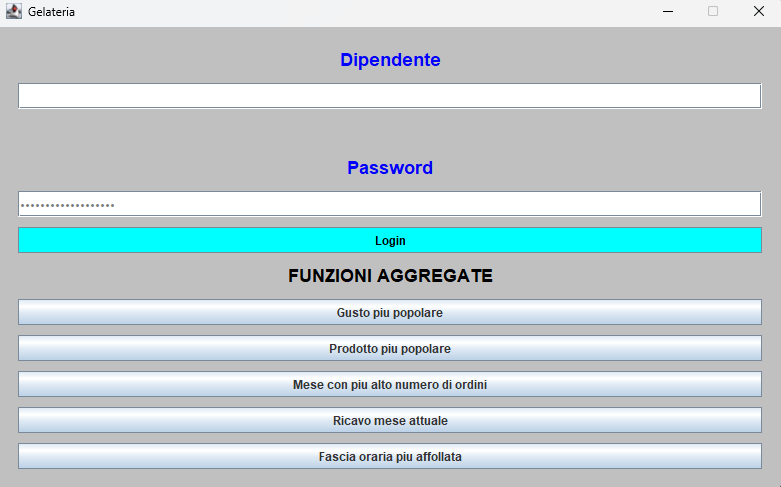
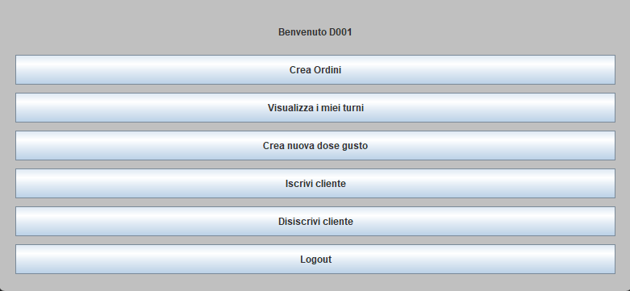
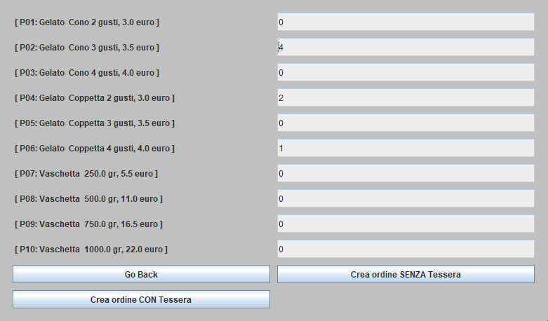
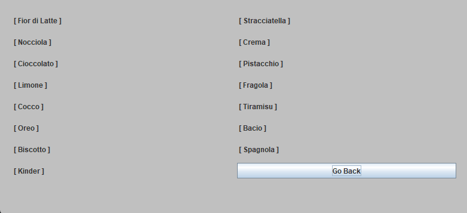

# 🍦 Gestionale Gelateria

[](README.md)
[](README.it.md)

*Read this in [English](README.md).*

Questa applicazione permette la gestione del personale e delle operazioni della gelateria. Segui le istruzioni qui sotto per configurare il database e avviare il progetto.

## 🛠️ Configurazione e Avvio

### 1. Setup del Database
Prima di avviare l'applicazione, è necessario preparare il database MySQL:

1.  **Crea la struttura**: Copia il contenuto del file `PROGETTO_DATABASE_GELATERIA.ddl` ed eseguilo nel tuo client MySQL (es. Workbench, DBeaver) o da riga di comando.
2.  **Popola i dati**: Esegui le query contenute nel file `queries_popolazioneDB.sql` per inserire i dati iniziali (dipendenti, prodotti, ecc.).

### 2. Avvio dell'Applicazione
1.  Apri la cartella del progetto con il tuo editor preferito (es. **Visual Studio Code**).
2.  Apri un nuovo terminale nella root del progetto.
3.  Esegui il comando di avvio con Gradle:

    ```bash
    ./gradlew run
    ```

---

## 🔐 Credenziali di Accesso

Utilizza le seguenti credenziali per testare le diverse funzionalità dell'applicazione.

### ✅ Dipendenti Attivi (Login Valido)
Questi account sono attivi e permettono l'accesso al sistema.

| Codice Dipendente | Password |
| :--- | :--- |
| **D001** | 11111 |
| **D002** | 22222 |
| **D003** | 33333 |
| **D007** | 77777 |
| **D008** | 88888 |

### ❌ Dipendenti Licenziati (Test Accesso Negato)
Utilizza queste credenziali per verificare che il sistema **blocchi** il login agli ex dipendenti.

| Codice Dipendente | Password | Note |
| :--- | :--- | :--- |
| **D004** | 44444 | Licenziato |
| **D005** | 55555 | Licenziato |
| **D006** | 66666 | Licenziato |

### 📸 Screenshots

<table>
  <tr>
    <td align="center">
      <b>Home Screen</b><br>
      
    </td>
    <td align="center">
      <b>Admin Dashboard</b><br>
      
    </td>
  </tr>
  <tr>
    <td align="center">
      <b>Customer Registration</b><br>
      
    </td>
    <td align="center">
      <b>New Order</b><br>
      
    </td>
  </tr>
  <tr>
    <td align="center">
      <b>Shift Management</b><br>
      
    </td>
    <td align="center">
      <b>Flavor Recipes (Doses)</b><br>
      
    </td>
  </tr>
</table>
